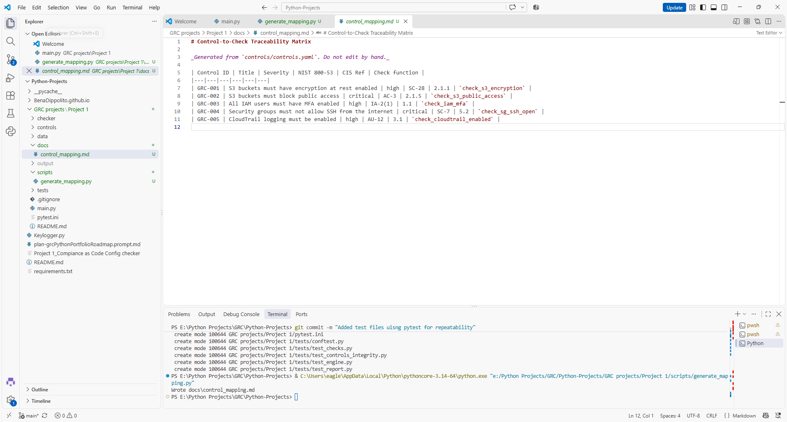

# GRC Config Checker

A compliance-as-code tool that tests cloud configurations against
CIS Benchmark-style controls mapped to NIST 800-53, producing
audit-ready JSON and CSV reports.



## The Problem
Manual configuration reviews are slow, inconsistent, and hard to
reproduce. This tool encodes control requirements as data and tests them
automatically, so every run is identical and every result is traceable
to a control, a framework requirement, and a specific failing resource.

## What It Does
- Loads control definitions from `controls/controls.yaml` (policy as data)
- Runs one check function per control against a configuration snapshot
- Reports **PASS / FAIL / N/A / ERROR** with resource-level findings
- Exports a timestamped JSON record and an auditor-friendly CSV
- Returns a non-zero exit code on failure, so CI pipelines can gate on it

## Controls Covered
| ID | Control | NIST 800-53 | Severity |
|---|---|---|---|
| GRC-001 | S3 encryption at rest | SC-28 | High |
| GRC-002 | S3 public access blocked | AC-3 | Critical |
| GRC-003 | IAM MFA enabled | IA-2(1) | High |
| GRC-004 | No public SSH | SC-7 | Critical |
| GRC-005 | CloudTrail logging active | AU-12 | High |

Full mapping: [docs/control_mapping.md](docs/control_mapping.md)
(CIS references are from CIS AWS Foundations Benchmark v8.1)

## Design Decisions (GRC Perspective)
- **Fail closed:** a missing attribute counts as a failure, because
  absence of evidence is not evidence of compliance.
- **Four statuses:** `ERROR` (the test broke) is distinct from `FAIL`
  (the control failed); `N/A` flags controls with no in-scope resources
  instead of silently passing them.
- **Explicit check registry:** YAML can only invoke functions that are
  deliberately registered, not arbitrary code.
- **Evidence integrity basics:** UTC ISO 8601 timestamps, and
  timestamped filenames so prior runs are never overwritten.
- **Untrusted input handling:** CSV output neutralizes spreadsheet
  formula injection from resource names.

## Quick Start
```bash
git clone https://github.com/<your-username>/grc-config-checker.git
cd grc-config-checker
python -m venv .venv
source .venv/bin/activate      # Windows: .venv\Scripts\activate
pip install -r requirements-dev.txt
python main.py
```
Reports are written to `output/`. A sample is in [`examples/`](examples/).

## Testing
```bash
pytest --cov=checker --cov-report=term-missing
```
[N] tests, [XX]% coverage. Includes parametrized check tests, engine
status tests, a golden-file scan test, and a control-integrity test
that verifies every YAML control maps to a real check.

## Project Structure
```
controls/    control definitions (YAML)
checker/     checks, engine, reporting
data/        mock AWS configuration
tests/       pytest suite
scripts/     documentation generators
examples/    sample reports (mock data only)
```

## Adding a Control
1. Add an entry to `controls/controls.yaml`
2. Write a `check_*` function in `checker/checks.py` and add it to the registry
3. Add tests, then run `python scripts/generate_mapping.py`

## Known Limitations
- Runs against mock data; live AWS collection is not implemented yet
- SSH check detects `0.0.0.0/0` only; IPv6 `::/0` is a documented gap
  (tracked as an `xfail` test)
- Point-in-time snapshot, not continuous monitoring

## Roadmap
- Live AWS collection via `boto3` (read-only IAM role)
- IPv6 detection
- Integration into a continuous controls monitoring pipeline (see Project 5)

## License
MIT